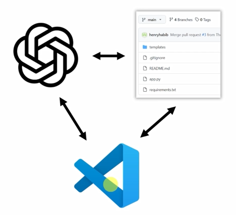

## Notes

1. What is Github Copilot?
   1. Its an amalgamation of three things.
   
      1. First is Generative AI
      2. Second is Code base
      3. Third is the IDE, its the paint brush.
   2. It allows you to run Generative AI tasks, given your codebase as the context, available in the IDE. 
2. Its proven to improve the productivity and happiness of the developer.
3. Different features
   1. In-Line code suggestions.
      1. As your typing in IDE, it gives you live suggestions, based on the context.
   2. Inline code actions
      1. Highlight some code, Ctrl + I, and ask co pilot to do something. Explian the code, generate unit tests, refactor, optimize, another way of doing it, etc.
   3. Chat with your code
      1. Three modes, ask, edit and agent.
   4. Bulk edit you code
      1. Three modes, ask, edit and agent.
   5. Include anything in the context including vision
      1. include a screen shots of errors and ask help. May be give a UI and ask it to give some html.
   6. AI Agents with extensions and tools.
      1. Allows you to have real pair program which can run some code for you. 
   7. Model agnostic
      1. Github is owned by MS, and Ms invested into open AI, but GHCP is model agnostic
         1. Clog model, or google gemini as well.
         2. 
   8. Personalize, with custom instructions and codebases
   9.  
4. Where can it be used?
   1. In your favorite IDE, like Vs Code etc.
   2. On GiiHub.com etc.
   3. On your CLI(for all os)
   4. GitHub Mobile.
      1. Just a novelty.
5. What needs to be learnt, learning objectives.
   1. Improve your productivity and happiness as a developer
   2. Learn and master all GitHub Copilot features, even nuanced ones.
   3. Learn to integrate GitHub Copilot into your day-to-day(Know when to use it)
   4. Accelerate and revolutionize your developer workflow.
6. For course road map, take a look at the Road Map pdf file in this folder.
7. How to succeed. 
   1. Do, dont just watch.
   2. Explore. Be curious. Do things outside of the things taught.
   3. Ask questions and get involved.
   4. 