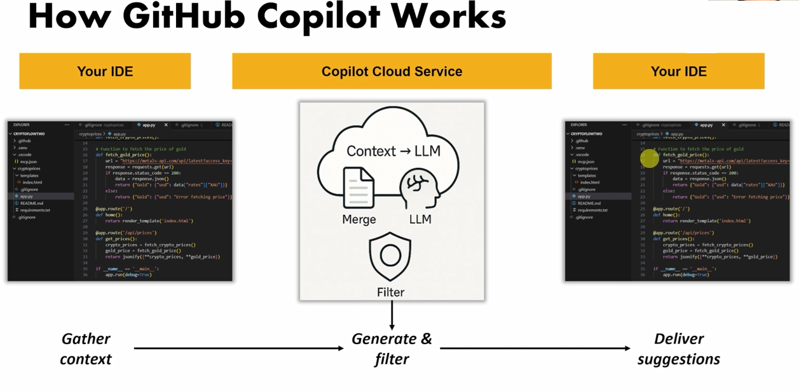
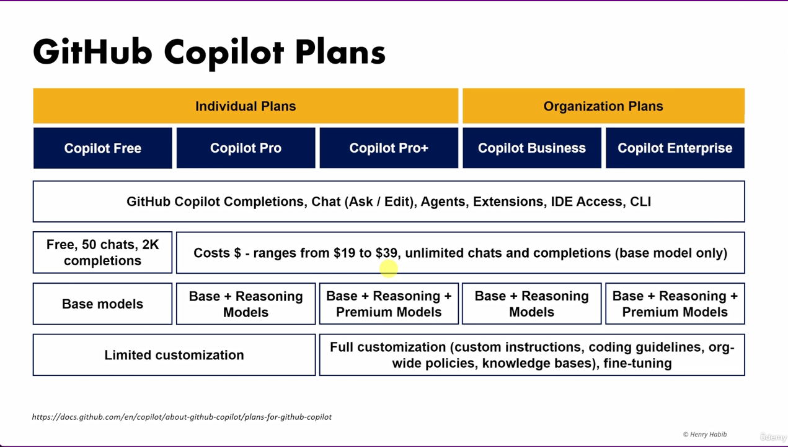
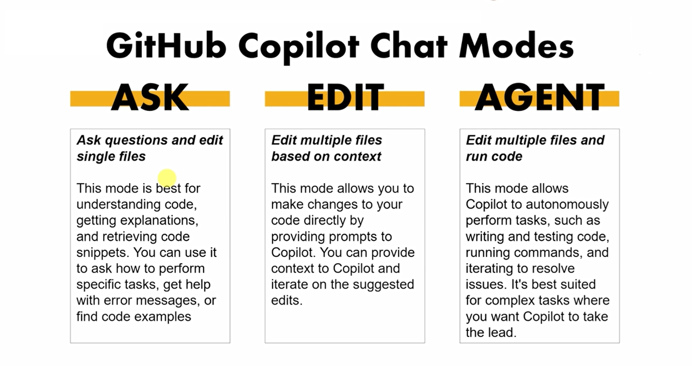
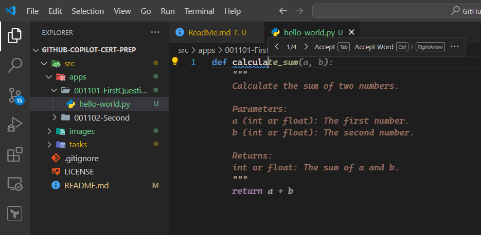
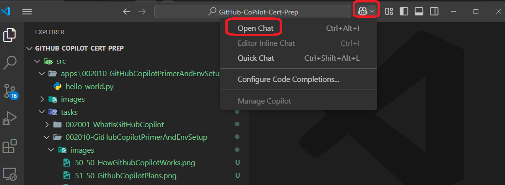
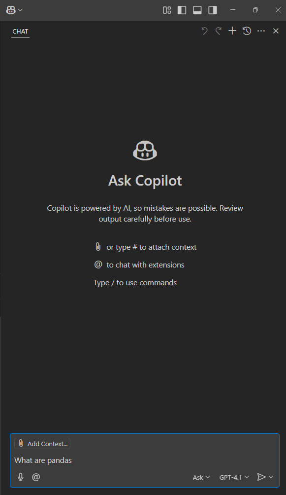
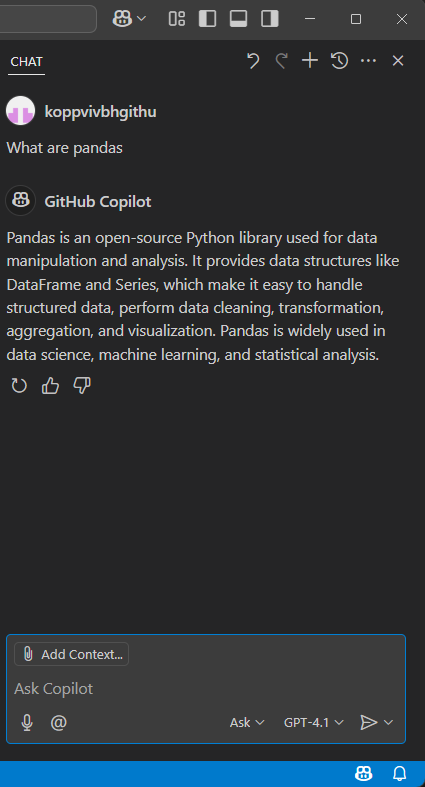

## Notes

1. How does github copilot work?
   1. You have an IDE, thats where you develop code.
   
   2. Thats the context, in fact the best context, for any generative query you make to the generative AI.
   
   3. The idea behind the github copilot is to have a generative AI system, to be aware of your context all the time.
   
   4. Since the github copilot sits right inside of the IDE, its always aware of whats happening on the IDE, like what files are open, and what you are coding or doing. etc.
   
   
   5. So the context for github copilot is taken from the IDE, then, when the developer takes gives the prompt(a task) in any mode (ask, edit, agent mode), it hands both to the LLM running on the cloud. The response that it gets is sent back to the IDE.

   6. Its Chat GPT, that has your code base as context available in your IDE.

2. Github plans.
   1. Here they are.
   
   2. asdf
3. Github Copilot Modes. There are three modes.
   1. Ask 
      1. questions and edit single files.
      2. This mode is best for understanding code snippets. You can use it to ask how to perform specific tasks, get help with error messages, or find code examples.
   
   2. Edit
      1. Edit multiple files based on context.
      2. This mode allows you to make changes to your code directly by providing prompts to copilot. you can provide context to copilot and iterate on the suggested edits.
   3. Agent
      1. Edit multiple files and run code.
      2. This mode allows copilot to autonomously perform tasks, such as writing and testing code, running commands, and iterating to resolve issues. Its best suited for complex tasks where you want copilot to take the lead.
4. First example.
   1. Here is a simple example of how to use github copilot.
   2. 
   3. 
   4. 
   5. 
   6. 