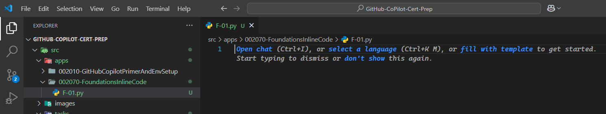
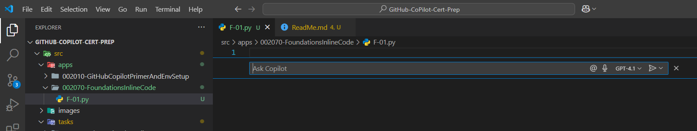
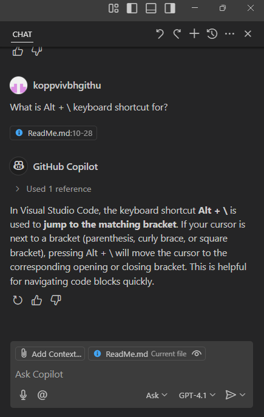
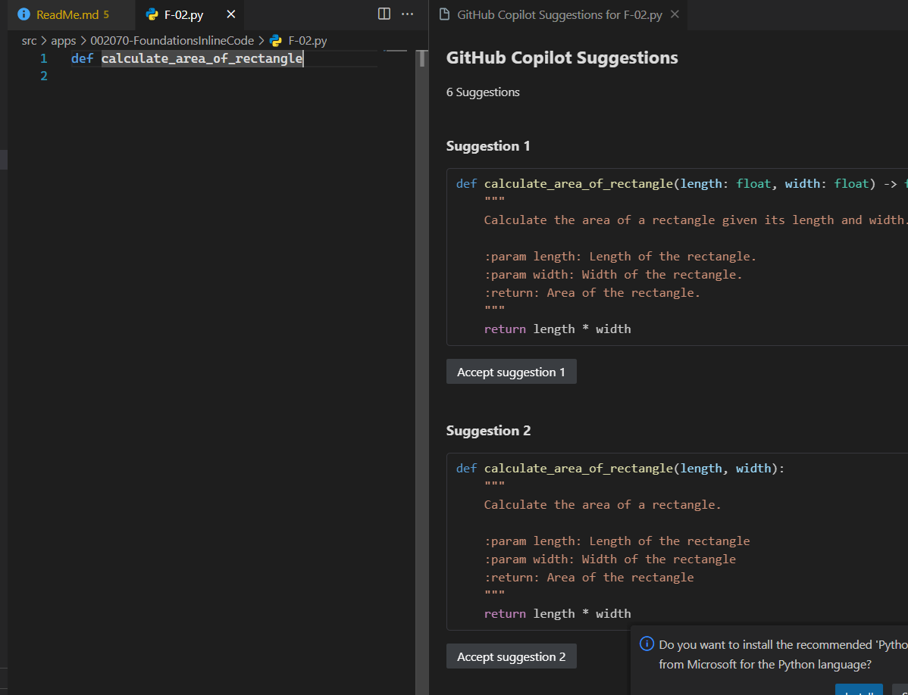

## Notes

1. AI Code completion or GhostText.
   1. The idea here is simple, you have a code editor, and you want to write code.
   2. As you type, the AI system will try to predict what you are going to type next.
   3. It will then suggest the next line of code, or even the entire function, with several lines of code.
   4. You can then accept the suggestion, or modify it, or reject it.
2. The downside is, 
   1. it may suggest something that is not relevant to your code.
   2. So it can be a distraction.
3. Keyboard shortcuts.
   1. You can use keyboard shortcuts to accept, modify, or reject the suggestions.
   2. For example, in VS Code, you can use
      1. `Tab` to accept the suggestion
      2. `Esc` to reject it
      3. `Ctrl + Space` to show the suggestions.
      4. `Ctrl + I` to show the inline suggestions.
4. `Ctrl + I` 
   1. is the default shortcut for inline suggestions in VS Code.
   
   2. Pressing `Ctrl + I` will show the inline suggestions. 
      1. This works in a python file. Not sure about other languages.
   
   3. To accept the suggestion, you can press `Tab`.
   4. To reject the suggestion, you can press `Esc`.
   5. `Ctrl + Right Arrow` will move the cursor to the next word. This way we can accept only a partial suggestion, of what copilot has suggested.

5. `Alt + \` will show the ghost text suggestions.
   1. You can press Tab to accept the suggestion.
   2. You can press Esc to reject the suggestion.

6. `Ctrl + Alt + B` will open the Copilot sidebar.
   

7. Github Copilot as Pair Programmer.
   1. You can also use the `Ctrl + Enter` shortcut to show the suggestions in the sidebar.
   
   2. If Ctrl + Enter does not work, you can use `Ctrl + Shift + P` to open the command palette and then type `Copilot: Open Completions Panel`.
      1. Ref 1: https://github.com/orgs/community/discussions/162320#discussioncomment-13417141
      2. Ref 2: https://stackoverflow.com/q/79657879/1977871
   3. 

