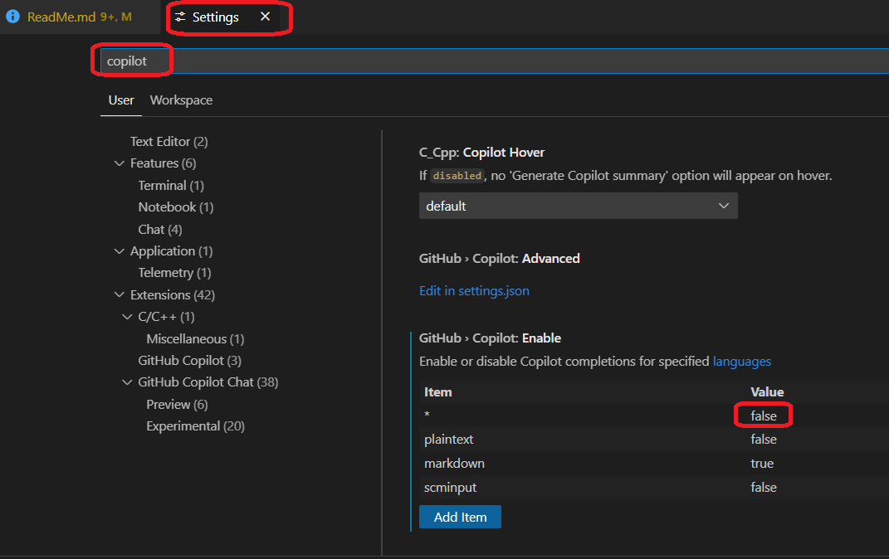
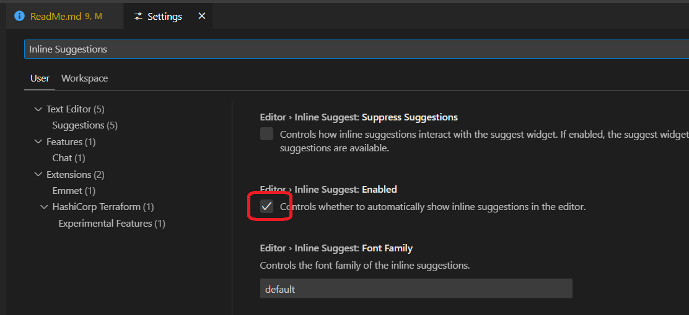
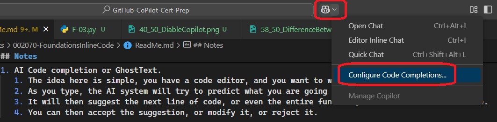
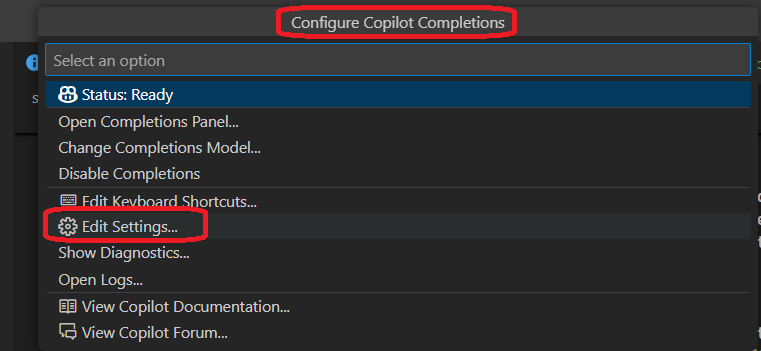
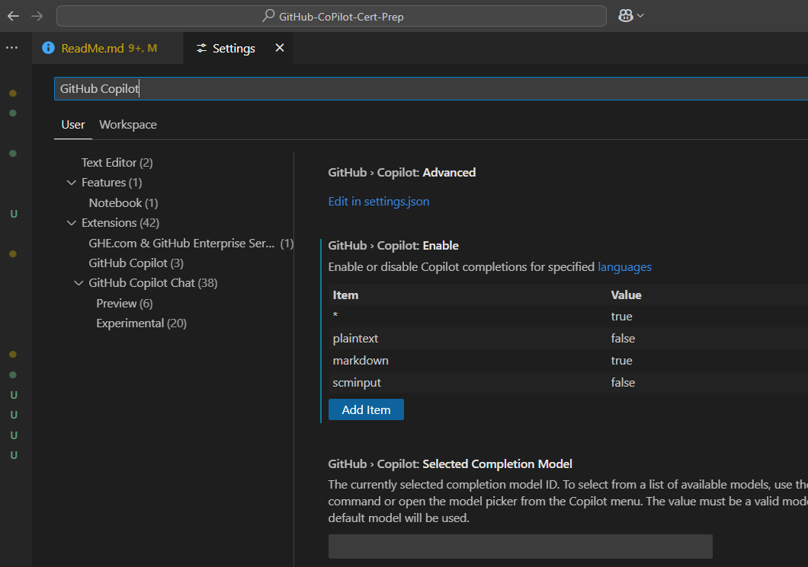
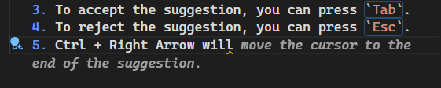
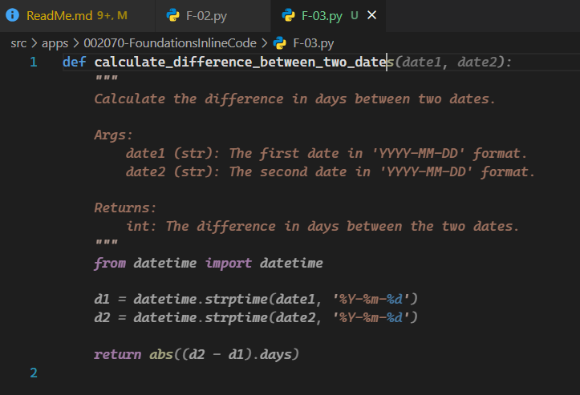
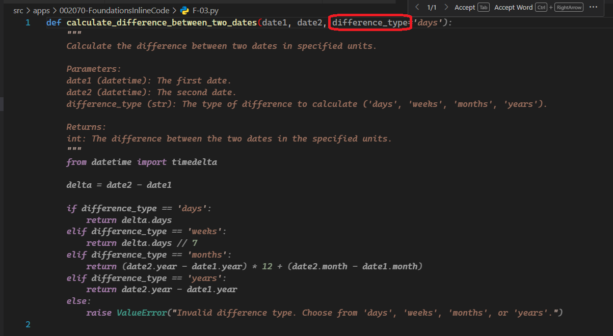
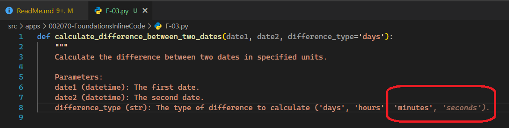
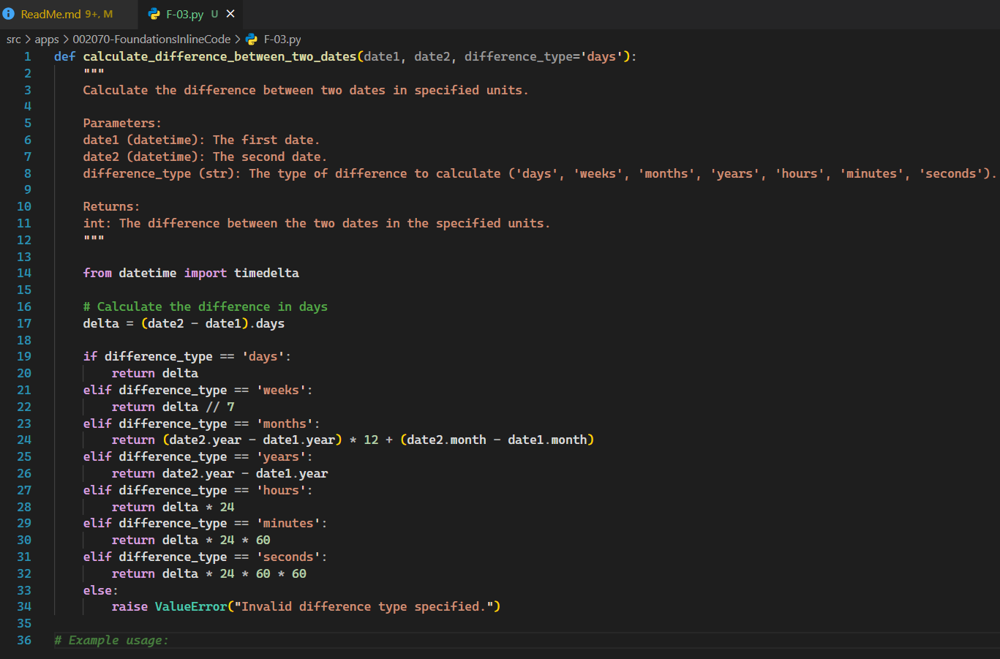

## Notes

1. AI Code completion or GhostText.
   1. The idea here is simple, you have a code editor, and you want to write code.
   2. As you type, the AI system will try to predict what you are going to type next.
   3. It will then suggest the next line of code, or even the entire function, with several lines of code.
   4. You can then accept the suggestion, or modify it, or reject it.

2. The downside is,
   1. It may suggest something that is not relevant to your code.
   2. So it can be a distraction. Of course, you can always reject the suggestion or modify it.
   3. You can also turn off the AI code completion feature if you find it distracting. How?
   4. In VS Code, you can go to `File -> Preferences -> Settings` and search for `copilot`.
      
   5. You can then turn off the `Inline Suggestions` feature. The following shows how to do that(not 100% sure). Go to `File -> Preferences -> Settings` and search for `Inline Suggestions`.
       
   6. You can go to the code settings as follows as well.
      1. Step 1
      
      2. Step 2
      
      3. Step 3
      
      4. asdf 
      5. asdf

3. Keyboard shortcuts.
   1. You can use keyboard shortcuts to accept, modify, or reject the suggestions.
   2. For example, in VS Code, you can use
      1. `Tab` to accept the suggestion
      2. `Esc` to reject it
      3. `Ctrl + Space` to show the suggestions.
      4. `Ctrl + I` to show the inline suggestions. See below for more details. 
      5. `Ctrl + Alt + B` to open the Copilot sidebar. See below for more details.
      6. `Ctrl + Enter` to show the suggestions in the sidebar. See below for more details.
      7. 

4. `Ctrl + I` 
   1. is the default shortcut for inline suggestions in VS Code.
      1. This works in a python file. Not sure about other languages. Not working in an mark down file.
      
   2. Pressing `Ctrl + I` will show the inline suggestions. 
      
   3. To accept the suggestion, you can press `Tab`.
   4. To reject the suggestion, you can press `Esc`.
5. `Alt + \` will show the ghost text suggestions.
   1. You can press Tab to accept the suggestion.
   2. You can press Esc to reject the suggestion.
   3. Note this is different from `Ctrl + Space bar` which shows the IntelliSense suggestions. 
6. `Ctrl + Right Arrow` will move the cursor to the next word. This way we can accept only a partial suggestion, of what copilot has suggested.
   

7. `Ctrl + Alt + B` will open the Copilot sidebar.

8. Github Copilot as Pair Programmer.
   1. You can also use the `Ctrl + Enter` shortcut to show the suggestions in the sidebar.
   
   2. If `Ctrl + Enter` does not work, you can use `Ctrl + Shift + P` to open the command palette and then type `Copilot: Open Completions Panel`.
      1. Ref 1: https://github.com/orgs/community/discussions/162320#discussioncomment-13417141
      2. Ref 2: https://stackoverflow.com/q/79657879/1977871

9. Code completion is as good as whatever that comes before the code completion.
   1. So if you want to calculate difference between two dates, I type the following as shown.
   

   2. But say I want the difference between two dates in days, months, years or hours, then I need to provide more context. As shown below, I added one more parameter difference_type. Now the AI system can understand what I want to do.
   

   3. Now lets say, I want to calculate the difference in hours, minutes and seconds as well.

   4. Now I do Ctrl + Right Arrow to accept the suggestion till hours, and then I type `, minutes, seconds` to add the additional parameters.
   

   5. Finally, here it is.
   

