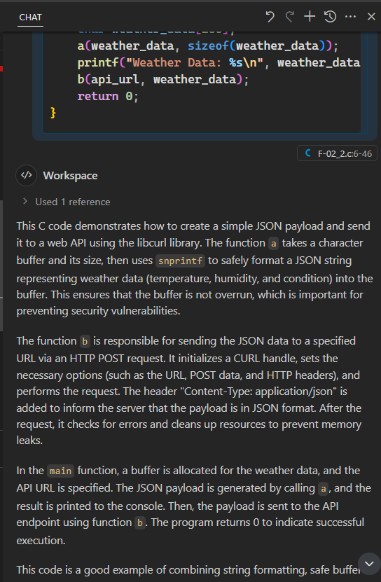
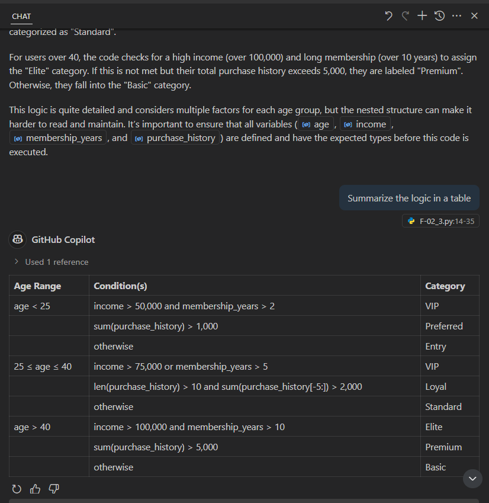

## Notes.

1. Say I have a c file, which I dont have much information about, and I want to understand it.
2. Let the file be F-02_2.c in the apps folder.
3. I can use inline code actions to explain the code in the file.
4. Open the file F-02_2.c, highlight the whole file, right click -> Copilot -> Explain.

5. The file has an error. So it tries to explain the error and tries to offer a fix.
6. Now select the code that is below that error, right click -> Copilot -> Explain.

7. Now ask for details about the code in a table format.

8. Here is the table format of the explanation.

9. Now you can ask for more details, to include output and input parameters.

10. Explain with a python file.
11. Open the file F-02_3.py, highlight the whole file. It has a lot of convoluted logic.

12. Now ask for details about the code in a table format.

