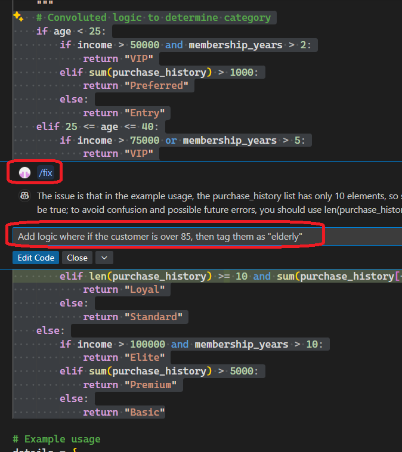

## Notes
1. In the file F-02_2.c, there is an error. Open the file and a red squiggly line will appear where the error is.

2. Ensure the cursor is on the line with the error. 
   1. Then press `Ctrl + .` to open the code action menu. 
   
   2. Or else you can click the lightbulb icon that appears next to the line with the error.
   3. Or you can hover on the line with the error and select "Quick Fix" from the context menu. 
   
   4. Once you get to the code action menu, select the option to "Fix using Copilot"
   5. 
3. Fixing a python file.
   1. Open the file F-02_3.py and select the lines as shown in the image below. Then right click -> Copilot -> Fix.
   2. 
   3. Here it looks as follows.
   4. 
   5. Now as copilot to add some additional logic as follows.
   6. 
   7. Now you can see the additional logic added.
   8. 
   